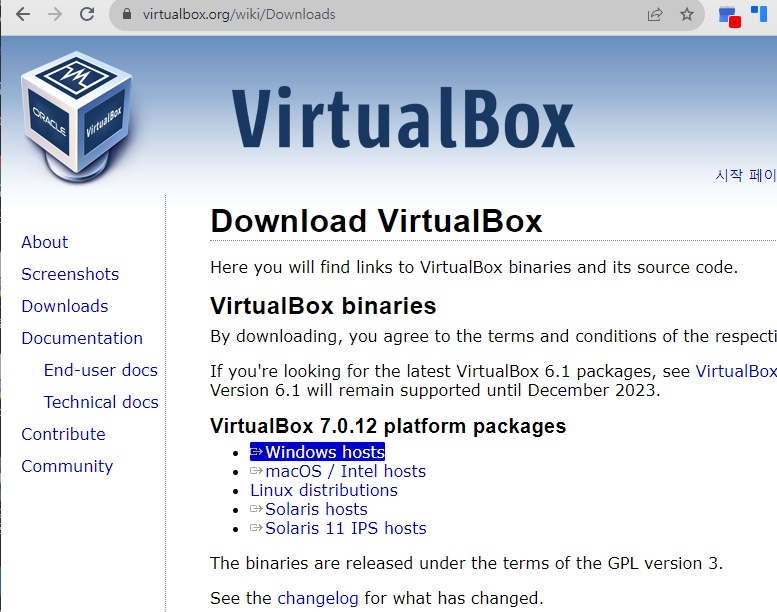
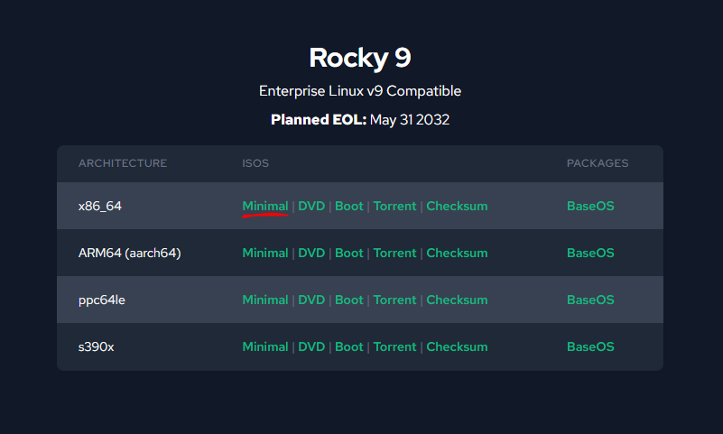
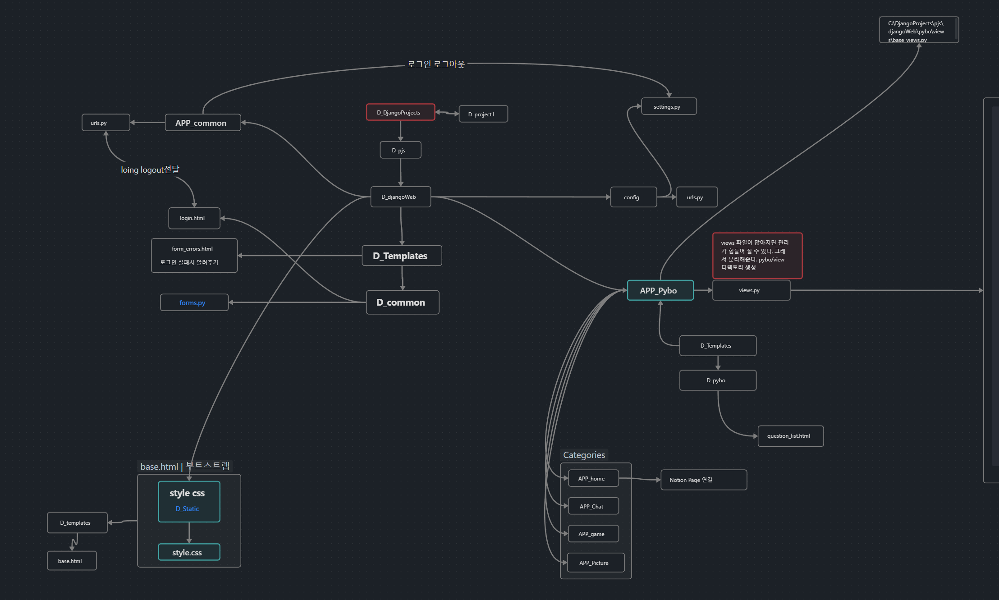

# Django 세미프로젝트

<aside>
💡 이름 : 신충식
과정명  : Django 세미 프로젝트

</aside>

목차

---

# 서론

### 1.1 미니프로젝트 개요

<aside>
💡 환경 : Windows10,11 ,, 리눅스 서버 Rokcy

Tools : Django, Html, CSS, Visual studio code, Python

주제 : 점프 투 장고

</aside>

### 1.2 세미프로젝트 주제 소개

본 프로젝트는 점프 투 장고 기반으로 해당 웹페이지를 만들어보고, 원하는 기능을 추가 해보았다. 

점프 투 장고 내용에 없는 것으로는 카테고리 생성과, 이미지 배너 생성이다. 

본 세미 프로젝트 중에 미흡한 점이 많아서 버그를 찾아내기 힘든 부분도 있엇으며

코드 내용에 주석과 함께 결과를 본 프로젝트 보고서에 담으려고 한다. 

# 본론

# 장고 프로젝트 구축

## 2.1 운영 환경

환경은 리눅스 환경 설치 및 Django 프로젝트 구성에 을 하고 Windows10 Visual studio code를 사용해서 코드 작성 후 리눅스 환경으로 실행이 되는지 목적에 있다. 서버 배포는 비용이 들기에 따로 하지 않았지만 만들어 보는데 목적을 둔다. 

## 2.1.1리눅스 환경 구성

이 프로젝트 진행을 위해 [Virtual Box 7](https://www.virtualbox.org/) 최신버전을 사용한다.  



1. Rocky 9 버전을 사용해 구성하기
    
    
    
    window환경에서 구성한다. minimal로 선택을 해주었다.
    
    
    
    머신 > 새로만들기
    
    
    
    설치 받은 Rocky.iso 파일을 집어넣어 줍니다. 
    
    
    
    
    
    연습용 지정이기에 그냥 대충 지어냈다. 
    
    
    
    메모리 할당은 4096MB CPU는 1개이기에 선택
    
    
    
    기본 disk는 20GB를 할당 하였다. 
    
    
    
    
    
    가상 머신에 설치 되면서 virtualbox가 실행이 될 것이다.  
    
    
    
    
    
    가상 머신이 자동 실행되고 Linux 커널 창이 뜨지 않을 것이다.  설정에서 저장소에 컨트롤러 IDE 과학드라이브 iso 파일을 잡아줘야 한다. 
    
2. Linux Setting 
    - 처음 실행시 main커널 창에 선택을 안하면 이렇게 설치 되버린다.
    
    
    
    
    
    기본 환경은 영어로 셋팅
    
    
    
    하단에 root 패스워드 설정해 달라고도 한다. 광학디스크는 그냥 들어갔다가Done누르게 되면 자동으로 잡힌다. 
    
    RootPassword 셋팅을 해주면 User는 따로 안해줘도 된다.  이후 하단에 Begin을 눌러주면 된다. 
    
    
    
    인스톨 후 Reboot시켜준다. 
    
3. 기본 설치
    
    ```bash
    yum update -y  설치 후에 밑에 명령어 실행 
    
    yum install kernel-devel gcc -y
    ```
    
    
    
    모든 설치가 완료되면 
    
    그래픽 모드를 셋팅해보자. 
    
4. **Rocky 9 그래픽 모드**
    
    기본 그래픽 모드는 해당 내용을 참고 하면 될 것 같다. 
    
    [https://ko.linux-console.net/?p=2743](https://ko.linux-console.net/?p=2743)
    
    정확히 따라가면 이런식으로 기본 GUI 화면이 표시되는 것을 볼 수 있다. (보통 실제 현업에서는 일반적인 muti-user 화면을 사용하지만. 테스트를 위해서 셋팅을 이렇게 해주었다.
    
    
    

## 2.2 파이썬 설치

### 2.2.1파이썬 가상환경 사용

1. 가상 환경 구성을 위해 `**DjangoProjects**`디렉토리를 생성하자. github 활용을 위해 깔끔하게 경로 통일을 해주었다. 

```bash
[Host01@servera] mkdir DjangoProjects

[Host01@servera ~]$ cd DjangoProjects/

[Host01@servera DjangoProjects]

```

> **Tip** 
sudo 권한을 미리 셋팅을 해줘야한다.
> 
> 1. **Root 계정으로 전환:** Root 계정으로 전환하여 명령을 실행할 수 있습니다. 다음 명령어를 사용하세요.
>     
>     ```bash
>     su -
>     ```
>     
>     그런 다음 root 비밀번호를 입력하십시오. 이제 root 권한으로 명령을 실행할 수 있게 된다.
>     
> 2. **사용자를 sudo 그룹에 추가:** 시스템 관리자에게 연락하여 sudo 권한을 부여받을 수 있도록 요청하세요. sudo 권한을 부여받으면 다음 명령어를 사용하여 사용자를 sudo 그룹에 추가할 수 있다.
>     
>     ```bash
>     su -
>     usermod -aG wheel Host01
>     
>     [root@servera ~] # id Host01
>     uid=1001(Host01) gid=1001(Host01) groups=1001(Host01),**10(wheel)**
>     ```
>     
>     이후에는 로그아웃하고 다시 로그인해야 변경 사항이 적용된다.
>     
>     ```bash
>     [root@servera ~]
>     # su - Host01
>     ```
>     

파이썬 버전 체크하고 최신으로 다운 받아 봅니다. 

```bash
[root@Server ~]# python -V
Python 3.9.18
```

1. 먼저, 새로운 Python 버전을 빌드하고 설치하기 위해 필요한 의존성을 설치한다. 
    
    ```bash
    sudo dnf groupinstall "Development Tools"
    sudo dnf install openssl-devel bzip2-devel libffi-devel zlib-devel
    ```
    
    1. **`"Development Tools"`** 그룹은 빌드 도구와 컴파일러 등을 포함하고 있는것
    2. **`openssl-devel`**, **`bzip2-devel`**, **`libffi-devel`**, **`zlib-devel`**는 Python이 사용하는 여러 라이브러리에 대한 개발 헤더 파일과 관련 라이브러리들을 설치한다.
    
2. Python 3.12.0 소스 코드를 다운로드합니다. 아래 명령어에서는 wget을 사용한다.
    
    ```bash
    cd /tmp
    wget https://www.python.org/ftp/python/3.12.0/Python-3.12.0.tgz
    ```
    
    
    
3. 압축을 해제하고 빌드 및 설치한다.
    
    ```bash
    tar xzf Python-3.12.0.tgz
    cd Python-3.12.0
    ./configure --enable-optimizations
    
    sudo make altinstall
    ```
    
    **`make altinstall`**을 사용하면 시스템 Python을 덮어쓰지 않고 새 버전을 별도의 설치로 유지할 수 있다.
    
4. 설치가 완료되면 새로운 Python 버전을 사용할 수 있습니다. 버전 확인을 위해 다음 명령어를 사용 해보자
    
    ```bash
    python3.12 --version
    ```
    
    
    

---

해당 경로에 대해 vevn 모듈을 설치해준다. 

```bash
[Host01@servera DjangoProjects]
$ python -m venv project1

[Host01@servera bin]$ ls
activate      activate.fish  pip   pip3.9  python3
activate.csh  Activate.ps1   pip3  python  python3.9
```

python -m venv는 파이썬 모듈 중 venv라는 모듈을 사용한다는 의미

Windows 환경에서는 Scripts라는 디렉토리에서 생성되었는데. 리눅스 환경상에서는 /bin/activate 에 생성 된다.  

가상 환경 진입이 가능한지 확인해보자

두가지 방법이 있다.

```bash
[Host01@servera bin]
$ . activate

[Host01@servera bin]
$ source activate
```

빠져나올려면 `**deactivate**` 사용하면 된다.

이제 가상 환경 내부에서 셋팅 해줘야 하는데. django 설치를 진행한다.

```bash
(project1) [Host01@servera bin]
$ pip install django==4.0.3
```


```bash
WARNING: You are using pip version 21.2.3; however, version 23.3.1 is available.
You should consider upgrading via the '/home/Host01/DjangoProjects/project1/bin/python -m pip install --upgrade pip' command.
```

warning 문구는 pop버전을 최신으로 설치하라는 말이다. 

```bash
(project1) [Host01@servera bin]
$ python -m pip install --upgrade pip

```

## 2.3  프로젝트 생성

장고 개발 환경이란, 장고를 로컬 컴퓨터에 설치하여 장고 어플리케이션을 개발, 실행, 테스트할 수 있는 환경을 말합니다. 로컬 컴퓨터는 자신이 어플리케이션을 개발하는데 사용하는 컴퓨터입니다. 어플리케이션을 실제 배포하기 전에 로컬 컴퓨터 위에서 어플리케이션을 실행 및 테스트할 수 있습니다.

루트 디렉토리 DjangoProject 하위로 여러프로젝트를 모아둘 디렉토리를 하나 생성한다. `pjs` 라고 생성하겠다.

```bash
(project1) [Host01@servera DjangoProjects]
$ mkdir pjs
(project1) [Host01@servera DjangoProjects]
$ cd pjs
(project1) [Host01@servera pjs]
```

또 만들어준 `**pjs`** 디렉토리에서 프로젝트 디렉토리를 하나 만들어준다. 

```bash
(project1) [Host01@servera pjs]
$ mkdir djangoWeb
(project1) [Host01@servera pjs]
$ cd djangoWeb
```

만들어준 디렉토리에 진입하여 장고 프로젝트를 생성하자

```bash
(project1) [Host01@servera djangoWeb]
$ django-admin startproject config .
```

config 다음에 점 기호(`.`)가 있음에 주의하자. 점 기호는 현재 디렉터리를 의미한다. 위 명령의 의미는 현재 디렉터리인 djangoWeb를 기준으로 프로젝트를 생성하겠다는 의미이다

더 쉽게는 이런 방법도 있다. 디렉토리와 함께 생성해 버리는 것이다.

```bash
(project1) C:\projects> django-admin startproject djangoWeb
```

**개발 서버 구동하기**

```bash
(project1) [Host01@servera djangoWeb]$ python manage.py runserver
Watching for file changes with StatReloader
Performing system checks...

System check identified no issues (0 silenced).

You have 18 unapplied migration(s). Your project may not work properly until you apply the migrations for app(s): admin, auth, contenttypes, sessions.
Run 'python manage.py migrate' to apply them.
December 08, 2023 - 05:24:25
Django version 4.0.3, using settings 'config.settings'
Starting development server at http://127.0.0.1:8000/
Quit the server with CONTROL-C.
```

장고 서버가 `http://127.0.0.1:8000/` 로 시작되었다는 것과 서버를 중지하기 위해서는 `CONTROL-C`를 입력하라는 내용

> 이렇게 개발을 위해 실행되는 장고 서버는 로컬호스트(localhost)로 실행되기 때문에 로컬 서버라고 부른다.
> 

이제 웹브라우저를 열고 주소창에 `http://127.0.0.1:8000/`을 입력해 보자.


### 2.3.1 환경변수 셋팅 및 진입점 만들기

리눅스 환경셋팅을 위해서 home(~) 에 있는 숨겨진 파일을 손봐야 한다.  (windows 상에서는 .cmd로 파일을 만들고, 경로를 셋팅해 주었는데., 리눅스에서는 host의 bashrc를 손보면 된다.)

```bash
[Host01@servera ~]
$ ls -al
total 32
(...생략...)
-rw-r--r--. 1 Host01 Host01   566 Dec  8 06:33 .bashrc
drwxr-xr-x. 5 Host01 Host01    80 Dec  8 05:56 DjangoProjects
```

해당 파일을 **`.bashrc`** 파일은 Bash 쉘에서 실행되는 초기 설정 및 사용자 정의 명령어를 포함하는 스크립트 파일이다. 이 파일은 사용자의 홈 디렉토리에 위치하며, 새로운 터미널 세션이나 로그인할 때마다 실행된다.

1. **환경 변수 설정:** 쉘에서 사용할 환경 변수를 설정합니다.
2. **Alias 정의:** 명령어나 명령어 시퀀스에 별칭(alias)을 부여합니다.
3. **커스텀 함수 정의:** 사용자 정의 함수를 정의하여 자주 사용하는 작업을 간편하게 수행할 수 있습니다.

bashrc에 해당 경로에 대한 alias를 정의해준다. 

```bash

alias activateDj='source /home/Host01/DjangoProjects/project1/bin/activate'
```

**`.bashrc`** 파일에 **`activateDj`**라는 별칭을 정의한 것을 확인하였다. 이제 해당 파일의 변경 사항을 적용하기 위해서는 터미널을 새로고침하거나 **`.bashrc`** 파일을 다시 로드해야 한다.아래와 같이 명령어를 실행 한다.

```bash
[Host01@servera ~] 중요한 것은 현재 경로
$ . .bashrc 

or 
source ~/.bashrc
```


activateDj 하게 되면 이런식으로 해당 경로로 activate되는 것을 볼 수 있다. 

# 기술적 요소

## 3.1 순서도



### 전체 트리 구조
<div>
**C:.
│  db.sqlite3
│  [manage.py](http://manage.py/)
│
├─chat (실패) - 서버 필요
│  │  [admin.py](http://admin.py/)
│  │  [apps.py](http://apps.py/)
│  │  [asgi.py](http://asgi.py/)
│  │  [consumers.py](http://consumers.py/)
│  │  [models.py](http://models.py/)
│  │  [routing.py](http://routing.py/)
│  │  [tests.py](http://tests.py/)
│  │  [urls.py](http://urls.py/)
│  │  [views.py](http://views.py/)
│  │  init.py
│  │
│  ├─migrations
│  │  │  0001_initial.py
│  │  │  0002_remove_chatmessage_user.py
│  │  │  init.py
│  │  │
│  │  └─__pycache__
│  │          0001_initial.cpython-312.pyc
│  │          0002_remove_chatmessage_user.cpython-312.pyc
│  │          init.cpython-312.pyc
│  │
│  ├─templates
│  │  └─chat
│  │          chat.html
│  │
│  └─__pycache__
│          admin.cpython-312.pyc
│          apps.cpython-312.pyc
│          models.cpython-312.pyc
│          urls.cpython-312.pyc
│          views.cpython-312.pyc
│          init.cpython-312.pyc
│
├─common
│  │  [admin.py](http://admin.py/)
│  │  [apps.py](http://apps.py/)
│  │  [forms.py](http://forms.py/)
│  │  [models.py](http://models.py/)
│  │  [tests.py](http://tests.py/)
│  │  [urls.py](http://urls.py/)
│  │  [views.py](http://views.py/)
│  │  init.py
│  │
│  ├─migrations
│  │  │  init.py
│  │  │
│  │  └─__pycache__
│  │          init.cpython-312.pyc
│  │
│  └─__pycache__
│          admin.cpython-312.pyc
│          apps.cpython-312.pyc
│          forms.cpython-312.pyc
│          models.cpython-312.pyc
│          urls.cpython-312.pyc
│          views.cpython-312.pyc
│          init.cpython-312.pyc
│
├─config
│  │  [asgi.py](http://asgi.py/)
│  │  [settings.py](http://settings.py/)
│  │  [urls.py](http://urls.py/)
│  │  [wsgi.py](http://wsgi.py/)
│  │  init.py
│  │
│  └─__pycache__
│          settings.cpython-312.pyc
│          urls.cpython-312.pyc
│          wsgi.cpython-312.pyc
│          init.cpython-312.pyc
│
├─game (시도중)
│  │  [admin.py](http://admin.py/)
│  │  [apps.py](http://apps.py/)
│  │  [models.py](http://models.py/)
│  │  [tests.py](http://tests.py/)
│  │  [urls.py](http://urls.py/)
│  │  [views.py](http://views.py/)
│  │  init.py
│  │
│  ├─migrations
│  │  │  0001_initial.py
│  │  │  init.py
│  │  │
│  │  └─__pycache__
│  │          0001_initial.cpython-312.pyc
│  │          init.cpython-312.pyc
│  │
│  ├─templates
│  │  └─game
│  │          game.html
│  │
│  └─__pycache__
│          admin.cpython-312.pyc
│          apps.cpython-312.pyc
│          models.cpython-312.pyc
│          urls.cpython-312.pyc
│          views.cpython-312.pyc
│          init.cpython-312.pyc
│
├─home
│  │  [admin.py](http://admin.py/)
│  │  [apps.py](http://apps.py/)
│  │  [models.py](http://models.py/)
│  │  [tests.py](http://tests.py/)
│  │  [urls.py](http://urls.py/)
│  │  [views.py](http://views.py/)
│  │  init.py
│  │
│  ├─migrations
│  │  │  init.py
│  │  │
│  │  └─__pycache__
│  │          init.cpython-312.pyc
│  │
│  ├─templates
│  │  └─home
│  │          home.html
│  │
│  └─__pycache__
│          admin.cpython-312.pyc
│          apps.cpython-312.pyc
│          models.cpython-312.pyc
│          urls.cpython-312.pyc
│          views.cpython-312.pyc
│          init.cpython-312.pyc
│
├─picture (실패)
│  │  [admin.py](http://admin.py/)
│  │  [apps.py](http://apps.py/)
│  │  [forms.py](http://forms.py/)
│  │  [models.py](http://models.py/)
│  │  [tests.py](http://tests.py/)
│  │  [urls.py](http://urls.py/)
│  │  [views.py](http://views.py/)
│  │  init.py
│  │
│  ├─migrations
│  │  │  0001_initial.py
│  │  │  0002_remove_picture_hashtag_picture_description.py
│  │  │  init.py
│  │  │
│  │  └─__pycache__
│  │          0001_initial.cpython-312.pyc
│  │          0002_remove_picture_hashtag_picture_description.cpython-312.pyc
│  │          init.cpython-312.pyc
│  │
│  ├─templates
│  │  └─pictures
│  │          picture.html
│  │
│  └─__pycache__
│          admin.cpython-312.pyc
│          apps.cpython-312.pyc
│          forms.cpython-312.pyc
│          models.cpython-312.pyc
│          urls.cpython-312.pyc
│          views.cpython-312.pyc
│          init.cpython-312.pyc
│
├─profiles (실패)
│  │  [admin.py](http://admin.py/)
│  │  [apps.py](http://apps.py/)
│  │  [models.py](http://models.py/)
│  │  [tests.py](http://tests.py/)
│  │  [urls.py](http://urls.py/)
│  │  [views.py](http://views.py/)
│  │  init.py
│  │
│  ├─migrations
│  │  │  0001_initial.py
│  │  │  init.py
│  │  │
│  │  └─__pycache__
│  │          0001_initial.cpython-312.pyc
│  │          init.cpython-312.pyc
│  │
│  ├─templates
│  │  └─profile (실패)
│  │          profile_image_upload.html
│  │
│  └─__pycache__
│          admin.cpython-312.pyc
│          apps.cpython-312.pyc
│          models.cpython-312.pyc
│          urls.cpython-312.pyc
│          views.cpython-312.pyc
│          init.cpython-312.pyc
│
├─pybo
│  │  [admin.py](http://admin.py/)
│  │  [apps.py](http://apps.py/)
│  │  [forms.py](http://forms.py/)
│  │  [models.py](http://models.py/)
│  │  [tests.py](http://tests.py/)
│  │  [urls.py](http://urls.py/)
│  │  views.txt
│  │  init.py
│  │
│  ├─migrations
│  │  │  0001_initial.py
│  │  │  0002_question_author.py
│  │  │  0003_answer_author.py
│  │  │  0004_answer_modify_date_question_modify_date_and_more.py**

**│  │  │  0005_answer_voter_question_voter_alter_answer_author_and_more.py
│  │  │  0006_picture.py
│  │  │  0007_photo_comment.py
│  │  │  init.py
│  │  │
│  │  └─__pycache__
│  │          0001_initial.cpython-312.pyc
│  │          0002_question_author.cpython-312.pyc
│  │          0003_answer_author.cpython-312.pyc
│  │          0004_answer_modify_date_question_modify_date_and_more.cpython-312.pyc
│  │          0005_answer_voter_question_voter_alter_answer_author_and_more.cpython-312.pyc
│  │          0006_picture.cpython-312.pyc
│  │          0007_photo_comment.cpython-312.pyc
│  │          init.cpython-312.pyc
│  │
│  ├─templates
│  │  └─pybo
│  │          answer_form.html
│  │          index.html
│  │          photo_detail.html
│  │          photo_home.html
│  │          question_detail.html
│  │          question_form.html
│  │          question_list.html
│  │          upload_picture.html
│  │
│  ├─templatetags
│  │  │  pybo_filter.py
│  │  │
│  │  └─__pycache__
│  │          pybo_filter.cpython-312.pyc
│  │
│  ├─views
│  │  │  answer_views.py
│  │  │  base_views.py
│  │  │  question_views.py
│  │  │
│  │  └─__pycache__
│  │          answer_views.cpython-312.pyc
│  │          base_views.cpython-312.pyc
│  │          question_views.cpython-312.pyc
│  │
│  └─__pycache__
│          admin.cpython-312.pyc
│          apps.cpython-312.pyc
│          forms.cpython-312.pyc
│          models.cpython-312.pyc
│          urls.cpython-312.pyc
│          views.cpython-312.pyc
│          init.cpython-312.pyc
│
├─static
│  │  bootstrap.min.css
│  │  bootstrap.min.js
│  │  photo_style.css (실패)
│  │  picture_home.css (실패)
│  │  style.css
│  │
│  └─Image
│          GIBEON.png
│
└─templates
│  base.html
│  form_errors.html
│  navbar.html
│
├─chat
│      chatmessage_list.html (실패)
│      chat_history.html (실패)
│
└─common
login.html
signup.html**
</div>

## 3.2 프로젝트 구현

### 3.2.1 Pybo URL View 생성

게시판 기능 생성을 위해서 pybo앱을 생성한다.

```bash
(project1) [Host01@servera djangoWeb]
$ django-admin startapp pybo
(project1) [Host01@servera djangoWeb]
$ ls
config  db.sqlite3  manage.py  pybo
```

pybo디렉토리가 생긴다. 해당 페이지를 열어보자.


404 오류는 브라우저가 요청한 페이지를 찾을 수 없을 경우에 발생한다

`config/urls.py` 파일에 `pybo/` URL에 대한 매핑을 추가한다. 장고의 urls.py 파일은 페이지 요청이 발생하면 가장 먼저 호출되는 파일로 URL과 뷰 함수 간의 매핑을 정의한다. 뷰 함수는 views.py 파일에 정의된 함수를 보면 된다.

1. django를 실행시킨 브라우저에서 로컬 서버로 [http://localhost:8000/pybo](http://localhost:8000/pybo) 페이지를 요청하면
2. [urls.py](http://urls.py) 파일에서 /pybo URL 매핑을 확인해서 views.py파일의 index함수를 호출 하고 호출한 결과를 브라우저에 반영한다 


### 3.2.2 URL 분리하기

이제 pybo앱 관련한 것들은 pybo앱 디렉토리 하위에 위치해야 한다.

config의 urls.py파일은 앱이 아닌 프로젝트 성격의 파일이므로 이곳에는 프로젝트 성격의 URL 매핑만 추가되어야 한다.

일단 urls.py를 수정

```python
from django.contrib import admin
from django.urls import path ,include

~~#from pybo import views  #test~~ 

urlpatterns = [
    path('admin/', admin.site.urls),
    ~~#path('pybo/', views.index), #test~~
    path('pybo/', include('pybo.urls')),
]
```

`path('pybo/', include('pybo.urls'))`의 의미는 `pybo/`로 시작하는 페이지를 요청하면 이제 `pybo/urls.py` 파일의 매핑 정보를 읽어서 처리하라는 의미이다

이제 특정 pybo/ 뒤에 추가되는 URL이 있을경우 config/urls.py를 수정할 필요없이 pybo/urls.py만 수정하면 된다. 

pybo에 새로운 urls.py를 만들어준다.

```python
(project1) [Host01@servera pybo]
$ touch urls.py
```

```python
# config/urls.py  에 매핑 정보를 전달해주는 urls.py이다
from django.urls import path

from . import views

urlpatterns = [
    path('', views.index),
]
```

`path('', views.index)` 처럼 `pybo/` 가 생략된 `''` 이 사용되었다. (`config/urls.py` 파일에서 이미 `pybo/`로 시작하는 URL이 `pybo/urls.py` 파일과 먼저 mapping되어서 이다.)

`pybo/` URL은 다음처럼 `config/urls.py` 파일에 매핑된 `pybo/` 와 `pybo/urls.py` 파일에 매핑된 `''` 이 더해져 `pybo/`가 된다


`pybo/urls.py` 파일에 `path('question/create/', ...)` 라는 URL매핑이 추가된다면 최종 매핑되는 URL은 `pybo/`가 더해진 `pybo/question/create/`가 될 것이다.

### 3.3.3 migration

개 중 적용되지 않아서 python [manage.py](http://manage.py) migrate를 실행해야 하는 문구가 뜨기도 한다.  가끔 기본적으로 설치되는 앱들이 프로젝트 생성시 불려드려져야 하는 경우가 있는데. 이는 

`DjangoProjects\pjs\dangoWeb\config\settings.py` 에 셋팅 해준다. 

```bash
INSTALLED_APPS = [
    'django.contrib.admin',
    'django.contrib.auth',
    'django.contrib.contenttypes',
    'django.contrib.sessions',
    'django.contrib.messages',
    'django.contrib.staticfiles',
    'home',
    'chat',
    'picture',
    'game',
]
```

데이터 베이스가 필요한 것들만 migrate가 필요하다. 

기본 설치된 앱 외에도 데이터베이스에 대한 정보도 정의되어있다.

```bash
# BASE_DIR 디렉터리 밑에 db.sqlite3 파일에 저장한다고 정의되어 있다. 
# BASE_DIR은 프로젝트 디렉터리를 의미
DATABASES = {
    'default': {
        'ENGINE': 'django.db.backends.sqlite3',
        'NAME': BASE_DIR / 'db.sqlite3',
    }
}
```

데이터 베이스 테이블들을 생성.

```bash
(djangoWeb) C:\DjangoProjects\pjs\djangoWeb>python manage.py migrate        
Operations to perform:
  Apply all migrations: admin, auth, chat, contenttypes, game, picture, sessions
Running migrations:
  No migrations to apply.
```

```bash
(djangoWeb) C:\DjangoProjects\pjs\djangoWeb>python manage.py shell
Python 3.12.0 (tags/v3.12.0:0fb18b0, Oct  2 2023, 13:03:39) [MSC v.1935 64 bit (AMD64)] on win32
Type "help", "copyright", "credits" or "license" for more information.
(InteractiveConsole)
>>> from pybo.models import Question, Answer
>>> from django.utils import timezone
>>> q = Question(subject='pybo가 무엇인가요?', content='pybo에 대해서 알고 싶습니다.', create_date=timezone.now
... ())
>>> q.save()
>>> q.id
1
```

### 3.3.4 장고 관리자 생성

```bash
(djangoWeb) C:\DjangoProjects\pjs\djangoWeb>python manage.py createsuperuser
```


장고 관리자는 쉽게 말해 메인 페이지에 올라오는 데이터 들을 관리자 입장에서 볼 수 있는 것이다. 

관리자로 로그인하면 회원가입이나 로그인 처리 질문에 올라오는 것들을 삭제 등이 가능하다. 


settings.py에 언어및 시간 설정을 바꿀 수 있다. 

### 3.3.5 부트스트랩 사용하기

[https://getbootstrap.com/docs/5.1/getting-started/download/](https://getbootstrap.com/docs/5.1/getting-started/download/)

⇒ 이 진행 과정을 위해서 5.1 사용을 한다. 이외의 것을 사용하면 현재 까지 진행 과정이 에러가 생길 수 있다고 한다. 


Django 에서 지원해주는 js와 css 파일들이다. 디자인프레임워크를 좀더 쉽게 개발 할 수 있도록 지원해주었다. 

부트 스트랩 외에도 다양한 것들이 있다. 

**웹페이지 프레임워크**

웹페이지 프레임 워크에는 부트스트랩을 이 과정 중에 사용했지만. 이외에도 다양한 종류가 있다. 

1. **Django Template Language (DTL):**
    - Django에 내장된 기본 템플릿 엔진인 DTL을 사용할 수 있습니다. DTL은 Python 코드를 템플릿 안에서 직접 실행할 수 있는 강력한 기능을 제공합니다.
2. **Jinja2:**
    - Jinja2는 Django에서는 기본적으로 지원하지 않지만, 선택적으로 사용할 수 있는 템플릿 엔진 중 하나입니다. 많은 개발자들이 Jinja2를 선호하며, Flask에서도 사용되고 있습니다.
3. **React, Vue.js, Angular:**
    - Django는 백엔드 프레임워크로 사용될 때, 프론트엔드에서는 JavaScript 라이브러리나 프레임워크를 함께 사용할 수 있습니다. React, Vue.js, Angular 등이 대표적인 프론트엔드 기술 중 일부입니다.
4. **Tailwind CSS:**
    - Tailwind CSS는 많은 사람들이 선호하는 CSS 프레임워크 중 하나입니다. Django와 함께 사용할 수 있고, 커스터마이징이 용이하며 간편한 클래스 기반의 스타일링을 제공합니다.
5. **Materialize CSS:**
    - Materialize CSS는 구글의 Material Design 가이드에 기반한 CSS 프레임워크로, 머터리얼 디자인을 쉽게 구현할 수 있습니다.


테이블을 이쁘게 만들어준다. 

# 주요 코드(code)

## pybo

### [urls.py](http://urls.py)

```python
# config/urls.py  에 매핑 정보를 전달해주는 urls.py이다

from django.urls import path, include
from .views import base_views, question_views, answer_views
#from . import views

#url 별칭 사용시 중복방지
app_name = 'pybo'

#name 을 붙여 해당 하는 것에 별칭을 정해줄 수 있다. 
urlpatterns = [
    #path('', views.index, name='index'),
    #path('<int:question_id>/', views.detail, name='detail'),
    #path('answer/create/<int:question_id>/', views.answer_create, name='answer_create'), 
    #path('question/create/', views.question_create, name='question_create'),
    #path('question/modify/<int:question_id>/', views.question_modify, name='question_modify'), #질문 수정
    #path('question/delete/<int:question_id>/', views.question_delete, name='question_delete'),
    #path('answer/modify/<int:answer_id>/', views.answer_modify, name='answer_modify'), # 답변 수정 -> Views
    #path('answer/delete/<int:answer_id>/', views.answer_delete, name='answer_delete'), # 답변 삭제
    
    # 외부 링크로 리다이렉트하는 경로
    path('home/', base_views.redirect_to_external_link, name='external_home'),

    # chat 앱의 URL을 포함합니다.
    path('chat/', include('chat.urls')),

    # 게임 앱의 홈 화면 경로
    path('game/', base_views.game_home, name='game_home'),

    # picture 앱의 URL을 포함합니다.
    path('picture/', include('picture.urls')),
    # profile 앱의 URL을 포함합니다.
    path('profiles/', include('profiles.urls')),

    # 기본 뷰 함수들의 URL 패턴
    # base_views.py
    path('',
         base_views.index, name='index'),
    path('<int:question_id>/',
         base_views.detail, name='detail'),

    # 질문과 관련된 뷰 함수들의 URL 패턴
    # question_views.py
    path('question/create/', question_views.question_create, name='question_create'),
    path('question/modify/<int:question_id>/', question_views.question_modify, name='question_modify'),
    path('question/delete/<int:question_id>/', question_views.question_delete, name='question_delete'),
    path('question/vote/<int:question_id>/', question_views.question_vote, name='question_vote'), #질문 추천

    # 답변과 관련된 뷰 함수들의 URL 패턴
    # answer_views.py
    path('answer/create/<int:question_id>/', answer_views.answer_create, name='answer_create'),
    path('answer/modify/<int:answer_id>/', answer_views.answer_modify, name='answer_modify'),
    path('answer/delete/<int:answer_id>/', answer_views.answer_delete, name='answer_delete'), #답변 삭제
    path('answer/vote/<int:answer_id>/', answer_views.answer_vote, name='answer_vote'),
]
```

### models[.py](http://urls.py)

```python
from django.db import models
from django.contrib.auth.models import User

# 제목, 내용, 작성일시 
class Question(models.Model):
    author = models.ForeignKey(User, on_delete=models.CASCADE, related_name='author_question')
    subject = models.CharField(max_length=200)
    content = models.TextField()
    create_date = models.DateTimeField()
    modify_date = models.DateTimeField(null=True, blank=True)
    voter = models.ManyToManyField(User, related_name='voter_question')  # 추천인 추가 
    
    def __str__(self):
        return self.subject

# 질문에 대한 답변 Question모델을 속성으로 가져간다. 
class Answer(models.Model):
    author = models.ForeignKey(User, on_delete=models.CASCADE, related_name='author_answer') # migrate시 데이터베이스에 null 허용 컬럼으로 생성
    question = models.ForeignKey(Question, on_delete=models.CASCADE)
    content = models.TextField()
    create_date = models.DateTimeField()
    modify_date = models.DateTimeField(null=True, blank=True)
    voter = models.ManyToManyField(User, related_name='voter_answer')
```

### forms.py

```python
# 요청시 전달되는 파라미터들을 쉽게 관리하기 위해 사용하는 클래스
from django import forms
from pybo.models import Question, Answer 

class QuestionForm(forms.ModelForm):
    class Meta:
        model = Question  # 사용할 모델
        fields = ['subject', 'content']  # QuestionForm에서 사용할 Question 모델의 속성
        # widgets = {
        #     'subject': forms.TextInput(attrs={'class': 'form-control'}),
        #     'content': forms.Textarea(attrs={'class': 'form-control', 'rows': 10}),
        # }
        # 질문등록창 기존 영어를 지정이름으로 바꿔준다. 
        labels = {
            'subject': '제목',
            'content': '내용',
        }  
        

class AnswerForm(forms.ModelForm):
    class Meta:
        model = Answer
        fields = ['content']
        labels = {
            'content': '답변내용',
        }
```

### templates/pybo/question_detail.html

```html



    <div class="container my-3">
        
        <!-- 메시지 표시 수정 -->
        
            <div class="alert alert-danger my-3" role="alert">
                
                    <strong>{{ message.tags }}</strong>
                    <ul><li>{{ message.message }}</li></ul>
                
            </div>
        

        <!-- 질문 -->
        <h2 class="border-bottom py-2">{{ question.subject }}</h2>
        <div class="card my-3">
            <div class="card-body">
                <div class="card-text">{{ question.content|mark }}</div> <!-- Markdown 적용 -->
                <div class="d-flex justify-content-end">
                    <!-- 질문 수정 일시 -->
                    
                        <div class="badge bg-light text-dark p-2 text-start mx-3">
                            <div class="mb-2">수정 일시</div>
                            <div>{{ question.modify_date }}</div>
                        </div>
                    
                    <div class="badge bg-light text-dark p-2 text-start">
                        <div class="mb-2">{{ question.author.username }}</div>
                        <div>{{ question.create_date }}</div>
                    </div>
                </div>
                <div class="my-3">
                    <!-- 질문 추천 버튼 -->
                    <a href="javascript:void(0)" data-uri="" class="recommend btn btn-sm btn-outline-secondary">
                        추천 <span class="badge rounded-pill bg-success">{{ question.voter.count }}</span>
                    </a>
                    <!-- 현재 사용자가 질문 작성자인 경우에만 수정 및 삭제 버튼 표시 -->
                    
                        <a href="" class="btn btn-sm btn-outline-secondary">수정</a>
                        <a href="#" class="delete btn btn-sm btn-outline-secondary" data-uri="">삭제</a>
                    
                </div>
            </div>
        </div>

        <!-- 답변 -->
        <h5 class="border-bottom my-3 py-2">답변이 {{ question.answer_set.count }}개 있습니다.</h5>
         <!-- 질문과 연결된 답변들 -->
            <a id="answer_{{ answer.id }}"></a> <!-- 앵커 -->
            <div class="card my-3">
                <div class="card-body">
                    <div class="card-text">{{ answer.content|mark }}</div> <!-- Markdown 적용 -->
                    <div class="d-flex justify-content-end">
                        <!-- 답변 수정 일시 -->
                        
                            <div class="badge bg-light text-dark p-2 text-start mx-3">
                                <div class="mb-2">수정 일시</div>
                                <div>{{ answer.modify_date }}</div>
                            </div>
                        
                        <div class="badge bg-light text-dark p-2 text-start">
                            <div class="mb-2">{{ answer.author.username }}</div>
                            <div>{{ answer.create_date }}</div>
                        </div>
                    </div>
                    <div class="my-3">
                        <!-- 답변 추천 버튼 -->
                        <a href="javascript:void(0)" data-uri="" class="recommend btn btn-sm btn-outline-secondary">
                            추천 <span class="badge rounded-pill bg-success">{{ answer.voter.count }}</span>
                        </a>
                        <!-- 현재 사용자가 답변 작성자인 경우에만 수정 버튼 표시 -->
                        
                            <a href="" class="btn btn-sm btn-outline-secondary">수정</a>
                            <a href="#" class="delete btn btn-sm btn-outline-secondary " data-uri="">삭제</a>
                        
                    </div>
                </div>
            </div>
        

        <!-- 답변 등록 폼 -->
        <form action="" method="post" class="my-3">
             <!-- CSRF 토큰 사용: 웹 사이트 취약점 공격 방지 -->

            <!-- 오류 표시 시작 -->
            <!-- 답변 내용을 입력하지 않았을 때 오류 표시 -->
            
                <div class="alert alert-danger" role="alert">
                    
                        
                            <div>
                                <strong>{{ field.label }}</strong>
                                {{ field.errors }}
                            </div>
                        
                    
                </div>
            
            <!-- 오류 표시 종료 -->

            <div class="mb-3">
                <textarea disabled
                          name="content" id="content" class="form-control" rows="10"></textarea>
            </div>
            <input type="submit" value="답변 등록" class="btn btn-primary">
        </form>
    </div>



<script type='text/javascript'>
const delete_elements = document.getElementsByClassName("delete");
Array.from(delete_elements).forEach(function(element) {
    element.addEventListener('click', function() {
        if(confirm("정말로 삭제하시겠습니까?")) {
            location.href = this.dataset.uri;
        };
    });
});
const recommend_elements = document.getElementsByClassName("recommend");
Array.from(recommend_elements).forEach(function(element) {
    element.addEventListener('click', function() {
        if(confirm("정말로 추천하시겠습니까?")) {
            location.href = this.dataset.uri;
        };
    });
});
</script>

```

### templates/pybo/question_form.html

```html



<div class="container">
    <h5 class="my-3 border-bottom pb-2">질문등록</h5>
    <!--<form method="post" action=""> --> <!--질문등록을 위한-->
    <form method="post">
        

        <!-- 오류표시 Start --> 
        <!--내용입력이 없을 시 오류표시-->
        
        <div class="alert alert-danger" role="alert">
            
            
            <div>
                <strong>{{ field.label }}</strong>
                {{ field.errors }}
            </div>
            
            
        </div>
        
        <!-- 오류표시 End -->

        <div class="mb-3">
            <label for="subject" class="form-label">제목</label>
            <input type="text" class="form-control" name="subject" id="subject"
                   value="{{ form.subject.value|default_if_none:'' }}">
        </div>
        <div class="mb-3">
            <label for="content" class="form-label">내용</label>
            <textarea class="form-control" name="content"
                    id="content" rows="10">{{ form.content.value|default_if_none:'' }}</textarea>
        </div>
        <button type="submit" class="btn btn-primary">저장하기</button>
    </form>
</div>

```

### templates/pybo/question_list.html

```html




  <!-- 테이블 부분 -->
  <div class="container my-3">
      <!--검색 및 질문등록 버튼-->
      <div class="row my-3">
        <div class="col-6">
            <a href="" class="btn btn-primary">질문 등록하기</a>
        </div>
        <div class="col-6">
            <div class="input-group">
                <input type="text" id="search_kw" class="form-control" value="{{ kw|default_if_none:'' }}">
                <div class="input-group-append">
                    <button class="btn btn-outline-secondary" type="button" id="btn_search">찾기</button>
                </div>
            </div>
        </div>
    </div>
    <table class="table">
      <!-- 테이블 헤더 -->
      <thead>
        <tr class="text-center table-dark">
          <th>번호</th>
          <th style="width:50%">제목</th>
          <th>글쓴이</th>
          <th>작성일시</th>
        </tr>
      </thead>

      <!-- 테이블 본문 -->
      <tbody>
        
          
            <tr class="text-center">
              <td>
                <!-- 번호 = 전체 리스트 개수 - 시작 인덱스 - 현재 인덱스 + 1 -->
                {{ question_list.paginator.count|sub:question_list.start_index|sub:forloop.counter0|add:1 }}
              </td>
              <td class="text-start">
                <!-- 각 행의 제목을 클릭하면 상세 페이지로 이동 -->
                <a href="">{{ question.subject }}</a>
                <!--답변 수 -->
                
                <span class="text-danger small mx-2">{{ question.answer_set.count }}</span>
                
              </td>
              <td>{{ question.author.username }}</td>  <!-- 글쓴이 추가 -->
              <td>{{ question.create_date }}</td>
            </tr>
          
          
          <tr>
              <td colspan="4">질문이 없습니다.</td>
          </tr>
          
        </tbody>
      </table>

      <!-- 페이징 처리 시작 -->
      <ul class="pagination justify-content-center">
        <!-- 이전 페이지 -->
        
          <li class="page-item">
            <a class="page-link" data-page="{{ question_list.previous_page_number }}" href="javascript:void(0)">이전</a>
          </li>
        
          <li class="page-item disabled">
              <a class="page-link" tabindex="-1" aria-disabled="true" href="#">이전</a>
          </li>
        

        <!-- 페이지 리스트 -->
        
          
            <!-- 템플릿 필터 -->
            
              <li class="page-item active" aria-current="page">
                <a class="page-link" data-page="{{ page_number }}" href="javascript:void(0)">{{ page_number }}</a>
              </li>
            
              <li class="page-item">
                <a class="page-link" data-page="{{ page_number }}" href="javascript:void(0)">{{ page_number }}</a>
              </li>
            
          
        

        <!-- 다음 페이지 -->
        
          <li class="page-item">
            <a class="page-link" data-page="{{ question_list.next_page_number }}" href="javascript:void(0)">다음</a>
          </li>
        
          <li class="page-item disabled">
              <a class="page-link" tabindex="-1" aria-disabled="true" href="#">다음</a>
          </li>
        
      </ul>
      <!-- 페이징 처리 종료 -->

      <!-- 질문 등록 버튼 상단으로 이동-->
      <!--<a href="" class="btn btn-primary">질문 등록하기</a>-->
    </div>
    <!--검색 폼 전송 page와 kw를 동시에 GET으로 요청-->
    <form id="searchForm" method="get" action="">
      <input type="hidden" id="kw" name="kw" value="{{ kw|default_if_none:'' }}">
      <input type="hidden" id="page" name="page" value="{{ page }}">
    </form>


<!--javascript 수정-->

<script type='text/javascript'>
// 링크의 data-page 속성값을 읽어 searchForm의 page 필드에 설정하여 searchForm을 요청
const page_elements = document.getElementsByClassName("page-link");
Array.from(page_elements).forEach(function(element) {
    element.addEventListener('click', function() {
        document.getElementById('page').value = this.dataset.page;
        document.getElementById('searchForm').submit();
    });
});
// 검색버튼을 클릭하면 검색어 텍스트창에 입력된 값을 searchForm의 kw 필드에 설정하여 searchForm을 요청
const btn_search = document.getElementById("btn_search");
btn_search.addEventListener('click', function() {
    document.getElementById('kw').value = document.getElementById('search_kw').value;
    document.getElementById('page').value = 1;  // 검색버튼을 클릭할 경우 1페이지부터 조회한다.
    document.getElementById('searchForm').submit();
});
</script>

```

### djangoWeb/views/base_views.py

```python
from django.core.paginator import Paginator  
from django.shortcuts import render, get_object_or_404, redirect
from django.db.models import Q
from django.contrib.auth.decorators import login_required
#from django.http import HttpResponseNotAllowed
from ..models import Question, Answer

#pybo\question_list.html
def index(request):
    page = request.GET.get('page', '1')  # 페이지
    kw = request.GET.get('kw', '')  # 검색어
    # ('-create_date') 역순으로 정렬 | order_by는 조회 결과를 정렬하는 함수
    question_list = Question.objects.order_by('-create_date') 
    if kw:
        question_list = question_list.filter(
            Q(subject__icontains=kw) |  # 제목 검색
            Q(content__icontains=kw) |  # 내용 검색
            Q(answer__content__icontains=kw) |  # 답변 내용 검색
            Q(author__username__icontains=kw) |  # 질문 글쓴이 검색
            Q(answer__author__username__icontains=kw)  # 답변 글쓴이 검색
        ).distinct()
    paginator = Paginator(question_list, 10)  # 페이지당 10개씩 보여주기
    page_obj = paginator.get_page(page)
    context = {'question_list': page_obj, 'page': page, 'kw': kw}
    # 파이썬 데이터를 템플릿에 적용하여 HTML로 반환하는 함수
    return render(request, 'pybo/question_list.html', context)

#pybo\question_detail.html
def detail(request, question_id):
    question = get_object_or_404(Question, pk=question_id)
    context = {'question': question}
    return render(request, 'pybo/question_detail.html', context)

# home 링크
def redirect_to_external_link(request):
    external_link = "https://gibeonsoftworks.notion.site/GIBEON-GAME-STUDIO-Customer-c412c9b24b7d4f2183396cdd3572e054?pvs=4"
    return redirect(external_link)

# Gmae 링크
def game_home(request):
    # game_home 뷰 함수의 내용 추가
    return render(request, 'pybo/game_home.html')  # 예시로 'pybo/game_home.html'을 렌더링하도록 함

#Profile
@login_required(login_url='common:login')
def profile(request):
    return render(request, 'pybo/profile.html')
```

### djangoWeb/views/answer_views.py

```python
from django.contrib import messages
from django.contrib.auth.decorators import login_required
from django.shortcuts import render, get_object_or_404, redirect, resolve_url
from django.utils import timezone

from ..forms import AnswerForm
from ..models import Question, Answer

@login_required(login_url='common:login')
#question_id는 URL 매핑에 의해 그 값이 전달
def answer_create(request, question_id):
    question = get_object_or_404(Question, pk=question_id)
    #answer = Answer(question=question, content=request.POST.get('content'), create_date=timezone.now())
    if request.method == "POST":
        form = AnswerForm(request.POST)
        if form.is_valid():
            answer = form.save(commit=False)
            answer.author = request.user  # author 속성에 로그인 계정 저장
            answer.create_date = timezone.now()
            answer.question = question
            answer.save()
            #return redirect('pybo:detail', question_id=question.id)
            return redirect('{}#answer_{}'.format(
                resolve_url('pybo:detail', question_id=question.id), answer.id))
    else:
        form = AnswerForm()
    context = {'question': question, 'form': form}
    return render(request, 'pybo/question_detail.html', context)
    

# 답변 수정 질문 수정과 동일
@login_required(login_url='common:login')
def answer_modify(request, answer_id):
    answer = get_object_or_404(Answer, pk=answer_id)
    if request.user != answer.author:
        messages.error(request, '수정권한이 없습니다')
        return redirect('pybo:detail', question_id=answer.question.id)
    if request.method == "POST":
        form = AnswerForm(request.POST, instance=answer)
        if form.is_valid():
            answer = form.save(commit=False)
            answer.modify_date = timezone.now()
            answer.save()
            #return redirect('pybo:detail', question_id=answer.question.id)
            return redirect('{}#answer_{}'.format(
                resolve_url('pybo:detail', question_id=answer.question.id), answer.id))
    else:
        form = AnswerForm(instance=answer)
    context = {'answer': answer, 'form': form}
    return render(request, 'pybo/answer_form.html', context)

#답변 삭제
@login_required(login_url='common:login')
def answer_delete(request, answer_id):
    answer = get_object_or_404(Answer, pk=answer_id)
    if request.user != answer.author:
        messages.error(request, '삭제권한이 없습니다')
    else:
        answer.delete()
    return redirect('pybo:detail', question_id=answer.question.id)

#답변 추천 버튼
@login_required(login_url='common:login')
def answer_vote(request, answer_id):
    answer = get_object_or_404(Answer, pk=answer_id)
    if request.user == answer.author:
        messages.error(request, '본인이 작성한 글은 추천할수 없습니다')
    else:
        answer.voter.add(request.user)
    #return redirect('pybo:detail', question_id=answer.question.id)
    return redirect('{}#answer_{}'.format(
                resolve_url('pybo:detail', question_id=answer.question.id), answer.id))
```

### djangoWeb/views/question_views.py

```python
from django.contrib import messages
from django.contrib.auth.decorators import login_required
from django.shortcuts import render, get_object_or_404, redirect
from django.utils import timezone

from ..forms import QuestionForm
from ..models import Question

@login_required(login_url='common:login')
def question_create(request):
    if request.method == 'POST':
        form = QuestionForm(request.POST)
        if form.is_valid():  # 폼이 유효하다면
            question = form.save(commit=False)  # 임시 저장하여 question 객체를 리턴받는다.
            question.author = request.user  # author 속성에 로그인 계정 저장
            question.create_date = timezone.now()  # 실제 저장을 위해 작성일시를 설정한다.
            question.save()  # 데이터를 실제로 저장한다.
            return redirect('pybo:index')
    else:
        form = QuestionForm()
    context = {'form': form}
    return render(request, 'pybo/question_form.html', context)

# 질문 수정
# Edit question
@login_required(login_url='common:login')  # 로그인이 필요한 상태에서만 접근 가능
def question_modify(request, question_id):
    # 주어진 question_id에 해당하는 Question 객체를 가져오거나 404 에러를 발생시킴
    question = get_object_or_404(Question, pk=question_id)
    
    # 현재 사용자가 해당 질문의 저자가 아니면 권한이 없다는 에러 메시지를 띄우고 상세 페이지로 리다이렉트
    if request.user != question.author:
        messages.error(request, 'You do not have permission to edit')
        return redirect('pybo:detail', question_id=question.id)
    
    # HTTP 요청이 POST 방식인 경우
    if request.method == "POST":
        # POST 데이터와 현재 question 객체를 사용하여 QuestionForm을 초기화
        form = QuestionForm(request.POST, instance=question)
        
        # 폼이 유효한 경우
        if form.is_valid():
            # 수정된 내용을 저장하되 데이터베이스에는 반영하지 않음(commit=False)
            question = form.save(commit=False)
            
            # 수정일자를 현재 시간으로 갱신
            question.modify_date = timezone.now()
            
            # 수정된 내용을 데이터베이스에 저장
            question.save()
            
            # 수정된 질문의 상세 페이지로 리다이렉트
            return redirect('pybo:detail', question_id=question.id)
    
    # HTTP 요청이 POST 방식이 아닌 경우 (첫 진입 시)
    else:
        # 현재 question 객체를 사용하여 QuestionForm을 초기화
        form = QuestionForm(instance=question)
    
    # 폼 객체를 context에 담아 템플릿으로 전달
    context = {'form': form}
    
    # 질문 수정 폼 템플릿을 렌더링
    return render(request, 'pybo/question_form.html', context)

# 삭제 버튼 정의
@login_required(login_url='common:login')
def question_delete(request, question_id):
    question = get_object_or_404(Question, pk=question_id)
    if request.user != question.author:
        messages.error(request, '삭제권한이 없습니다')
        return redirect('pybo:detail', question_id=question.id)
    question.delete()
    return redirect('pybo:index')

# 질문 추천 버튼
@login_required(login_url='common:login')
def question_vote(request, question_id):
    question = get_object_or_404(Question, pk=question_id)
    if request.user == question.author:
        messages.error(request, '본인이 작성한 글은 추천할수 없습니다')
    else:
        question.voter.add(request.user)
    return redirect('pybo:detail', question_id=question.id)
```

# config

### settings.py

```python
from pathlib import Path
import os

# Build paths inside the project like this: BASE_DIR / 'subdir'.
BASE_DIR = Path(__file__).resolve().parent.parent

# Quick-start development settings - unsuitable for production
# See https://docs.djangoproject.com/en/4.0/howto/deployment/checklist/

# SECURITY WARNING: keep the secret key used in production secret!
SECRET_KEY = 'django-insecure-1t!hoq$fqb6)f@s%2to+1gg62a#8k$nu8qu*ob+(kzwshlcam5'

# SECURITY WARNING: don't run with debug turned on in production!
DEBUG = True

ALLOWED_HOSTS = ['*']

# Application definition

INSTALLED_APPS = [
    'common.apps.CommonConfig',  #  common 앱 등록
    'pybo.apps.PyboConfig', #해당 클래스는 pybo.apps파일에 있는 클래스
    'django.contrib.admin',
    'django.contrib.auth', # 로그인 로그아웃 기능 
    'django.contrib.contenttypes',
    'django.contrib.sessions',
    'django.contrib.messages',
    'django.contrib.staticfiles',
    'profiles',
    'home',
    'chat',
    'picture',
    'game',
]

MIDDLEWARE = [
    'django.middleware.security.SecurityMiddleware',
    'django.contrib.sessions.middleware.SessionMiddleware',
    'django.middleware.common.CommonMiddleware',
    'django.middleware.csrf.CsrfViewMiddleware', # 보안 취약점csrf를 사용하기 위함
    'django.contrib.auth.middleware.AuthenticationMiddleware',
    'django.contrib.messages.middleware.MessageMiddleware',
    'django.middleware.clickjacking.XFrameOptionsMiddleware',
]

ROOT_URLCONF = 'config.urls'

TEMPLATES = [
    {
        'BACKEND': 'django.template.backends.django.DjangoTemplates',
        'DIRS': [BASE_DIR / 'templates'], # 템플릿 디렉터리를 여러개 등록할 수 있도록 리스트로 되어 있다
        'APP_DIRS': True,
        'OPTIONS': {
            'context_processors': [
                'django.template.context_processors.debug',
                'django.template.context_processors.request',
                'django.contrib.auth.context_processors.auth',
                'django.contrib.messages.context_processors.messages',
            ],
        },
    },
]

WSGI_APPLICATION = 'config.wsgi.application'

# Database
# https://docs.djangoproject.com/en/4.0/ref/settings/#databases

# BASE_DIR 디렉터리 밑에 db.sqlite3 파일에 저장한다고 정의되어 있다. 
# BASE_DIR은 프로젝트 디렉터리를 의미
DATABASES = {
    'default': {
        'ENGINE': 'django.db.backends.sqlite3',
        'NAME': BASE_DIR / 'db.sqlite3',
    }
}

# Password validation
# https://docs.djangoproject.com/en/4.0/ref/settings/#auth-password-validators

AUTH_PASSWORD_VALIDATORS = [
    {
        'NAME': 'django.contrib.auth.password_validation.UserAttributeSimilarityValidator',
    },
    {
        'NAME': 'django.contrib.auth.password_validation.MinimumLengthValidator',
    },
    {
        'NAME': 'django.contrib.auth.password_validation.CommonPasswordValidator',
    },
    {
        'NAME': 'django.contrib.auth.password_validation.NumericPasswordValidator',
    },
]

# Internationalization
# https://docs.djangoproject.com/en/4.0/topics/i18n/

LANGUAGE_CODE = 'ko-kr'

TIME_ZONE = 'Asia/Seoul'

USE_I18N = True

USE_TZ = True

# Static files (CSS, JavaScript, Images)
# https://docs.djangoproject.com/en/4.0/howto/static-files/

STATIC_URL = 'static/'
#리스트 변수 static 디렉토리
STATICFILES_DIRS = [
    BASE_DIR / 'static',
]
# Default primary key field type
# https://docs.djangoproject.com/en/4.0/ref/settings/#default-auto-field

DEFAULT_AUTO_FIELD = 'django.db.models.BigAutoField'

# 로그인 성공후 이동하는 URL
LOGIN_REDIRECT_URL = '/'

# 로그아웃시 이동하는 URL
LOGOUT_REDIRECT_URL = '/'

BASE_DIR = Path(__file__).resolve().parent
MEDIA_ROOT = os.path.join(BASE_DIR, 'media')
MEDIA_URL = '/media/'
```

### urls.py

```python
from django.contrib import admin
from django.urls import path ,include
from pybo.views import base_views
#from pybo import views

urlpatterns = [
    path('admin/', admin.site.urls),
    path('pybo/', include('pybo.urls')), # pybo 에 연결 시켜서 pybo에 있는 urls.py에 연동
    path('common/', include('common.urls')),
    path('', base_views.index, name='index'),  # '/' 에 해당되는 path
    path('', include('profiles.urls')),

```

# djangoWeb/templates

### base.html

```html

<!doctype html>
<html lang="ko">
<head>
    <!-- Required meta tags -->
    <meta charset="utf-8">
    <meta name="viewport" content="width=device-width, initial-scale=1, shrink-to-fit=no">
    <!-- Bootstrap CSS -->
    <link rel="stylesheet" type="text/css" href="">
    <!-- pybo CSS -->
    <link rel="stylesheet" type="text/css" href="">
    <title>I'm your friend</title> <!--페이지 표시 이름-->
</head>

<body>
  <!-- 배너 추가 -->
  <div id="banner">
    
  </div>
<!-- 네비게이션바 -->


<!--카테고리-->
<!-- Bootstrap CSS 파일 로드 -->
<link rel="stylesheet" type="text/css" href="">

<!-- Bootstrap 네비게이션 바 추가 -->
<nav class="navbar navbar-expand-lg navbar-light bg-light">
  <div class="container">
    <div class="row">
      <div class="col-lg-3 col-md-6">
      <a class="navbar-brand" href="" target="_blank">Home</a>
      </div>
      <div class="col-lg-3 col-md-6">
        <a class="navbar-brand" href="" target="_blank">Chat</a>
      </div>
      <div class="col-lg-3 col-md-6">
        <a class="navbar-brand" href="" target="_blank">Game</a>
      </div>

      <!-- Add more categories if needed -->
    </div>
</nav>

<!-- 기본 템플릿 안에 삽입될 내용 Start -->



<!-- 기본 템플릿 안에 삽입될 내용 End -->

<!-- Bootstrap JS static/bootstrap.min.js -->
<script src=""></script>

<!-- 자바스크립트 Start -->

<script>
  document.addEventListener('DOMContentLoaded', function() {
    const banner = document.getElementById('banner');

    window.addEventListener('scroll', () => {
      const scrollPosition = window.scrollY;
      const maxBannerHeight = 100; // set max height to 100px

      const newBannerHeight = Math.max(maxBannerHeight - scrollPosition, 0);
      banner.style.height = `${newBannerHeight}px`;
    });
  });
</script>

<!-- 자바스크립트 End -->
</body>
</html>
```

### form_errors.html

```html
<!-- 필드 오류와 넌필드 오류를 출력한다. -->

<div class="alert alert-danger">
    
    <!-- 필드 오류 -->
    
    <div>
        <strong>{{ field.label }}</strong>
        {{ field.errors }}
    </div>
    
    
    <!-- 넌필드 오류 -->
    
    <div>
        <strong>{{ error }}</strong>
    </div>
    
</div>

```

### navbar.html

```html
<!-- 네비게이션바 -->
<nav class="navbar navbar-expand-lg navbar-light bg-light border-bottom">
    <div class="container-fluid">
        <a class="navbar-brand" href="">GIBEON Softworks</a>
        <button class="navbar-toggler" type="button"
                data-bs-toggle="collapse"
                data-bs-target="#navbarSupportedContent"
                aria-controls="navbarSupportedContent"
                aria-expanded="false"
                aria-label="Toggle navigation">
            <span class="navbar-toggler-icon"></span>
        </button>
        
        <div class="collapse navbar-collapse" id="navbarSupportedContent">
            <ul class="navbar-nav me-auto mb-2 mb-lg-0">
                <li class="nav-item">
                    
                    <a class="nav-link" href="">{{ user.username }} (로그아웃)</a>
                    
                    <a class="nav-link" href="">로그인</a>
                    
                </li>
                <li>
                    
                    <a class="nav-link" href="">회원가입</a>
                    
                </li>
            </ul>
        </div>
    </div>
</nav>
```

### common/login.html

```html


<div class="container my-3">
    <form method="post" action="">
        
        <input type="hidden" name="next" value="{{ next }}">  <!-- 로그인 성공후 이동되는 URL -->
        
        <div class="mb-3">
            <label for="username">사용자ID</label>
            <input type="text" class="form-control" name="username" id="username"
                   value="{{ form.username.value|default_if_none:'' }}">
        </div>
        <div class="mb-3">
            <label for="password">비밀번호</label>
            <input type="password" class="form-control" name="password" id="password"
                   value="{{ form.password.value|default_if_none:'' }}">
        </div>
        <button type="submit" class="btn btn-primary">로그인</button>
    </form>
</div>

```

### common/signup.html

```html



<div class="container my-3">
    <!-- 회원가입 양식(form) -->
    <form method="post" action="">
        
        
        <!-- 에러 메시지 표시 -->
        
        
        <!-- 사용자명 입력 필드 -->
        <div class="mb-3">
            <label for="username">Username</label>
            <input type="text" class="form-control" name="username" id="username"
                   value="{{ form.username.value|default_if_none:'' }}">
        </div>

        <!-- 비밀번호 입력 필드 -->
        <div class="mb-3">
            <label for="password1">Password</label>
            <input type="password" class="form-control" name="password1" id="password1"
                   value="{{ form.password1.value|default_if_none:'' }}">
        </div>

        <!-- 비밀번호 확인 입력 필드 -->
        <div class="mb-3">
            <label for="password2">Confirm password</label>
            <input type="password" class="form-control" name="password2" id="password2"
                   value="{{ form.password2.value|default_if_none:'' }}">
        </div>
        
        <!-- 이메일 입력 필드 -->
        <div class="mb-3">
            <label for="email">Email</label>
            <input type="text" class="form-control" name="email" id="email"
                   value="{{ form.email.value|default_if_none:'' }}">
        </div>

        <!-- 회원가입 버튼 -->
        <button type="submit" class="btn btn-primary">Create</button>
    </form>
    <!-- 회원가입 양식 끝 -->
</div>

```

# 서비스 개발

## 4.4 로그인 및 로그아웃

### 로그인 로그아웃

```python
INSTALLED_APPS = [
    'common.apps.CommonConfig',  #  common 앱 등록
    'pybo.apps.PyboConfig', #해당 클래스는 pybo.apps파일에 있는 클래스
    'django.contrib.admin',
    'django.contrib.auth',
    'django.contrib.contenttypes',
    'django.contrib.sessions',
    'django.contrib.messages',
    'django.contrib.staticfiles',
    'django.contrib.auth', # 로그인 로그아웃 기능 
    'home',
    'chat',
    'picture',
    'game',
]
```

로그인 · 로그아웃을 "공통 기능을 가진 앱"이라는 의미의 common 앱 생성

```bash
(djangoWeb) C:\DjangoProjects\pjs\djangoWeb>django-admin startapp common
```


로그인 로그아웃 창이다.

로그인 시 회원은 질문 등록 및 댓글 등을 달 수 있다. 


common앱에서 이 일을 처리 할 수 있도록 하고, pybo앱과 함께 연동 처리 되어있다.


로그인 후에는 자기가 질문을 등록했을 때 글쓴이를 볼 수 있다. 

## 4.5 회원가입


페이지 상단에 이런식으로 회원가입을 누르게 되면 회원 처리가 될 수 있도록 하였다. 

이것은 회원 가입시 데이터를 전달하는 듯 하다.  


회원가입 후에 이렇게 잘못 입력했을 때 오류 메세지가 출력이 된다. 

질문을 등록할 시 

답변을 등록하고 싶을 때 무조건 회원가입을 해야만 등록 가능하도록 처리 되어있다. 

## 4.6 Main Home 링크 연결


두가지 기능이 있다. GIBEON Softworks를 누를시 해당 질문 등록 창으로 넘어오게 된다. 

그러나 Home 버튼을 누를 시 노션 페이지가 열리도록 하였다. 


pybo/views/base_views.py 

```python
# home 링크
def redirect_to_external_link(request):
    external_link = "https://gibeonsoftworks.notion.site/GIBEON-GAME-STUDIO-Customer-c412c9b24b7d4f2183396cdd3572e054?pvs=4"
    return redirect(external_link)
```

이곳에 등록된 home 링크를 통하여 request받게 하였다. 이는 question

# 결론

## 5.1 프로젝트 결과 정리


```html

```

이번 시간적인 제한으로 인해 각 카테고리의 기능 구성을 하지 못했다. 

Home은 유일하게 해당 페이지로 연결 시켜 주었고, 사실은 블로그 형태의 Django구성을 배우면 좋을 듯 싶다. 만약 메인 홈페이지가 있다면 Home이 그 페이지가 되고 지금 질문 등록 페이지가 고객 센터 쯤 되지 않을까 싶다. 

### chat

기능 구현에 조금 아쉬운 점이 많다. 해당 내용을 구성할 때 아직 이해 못한 프레임워크방식과 파이썬과 Html, css가 합쳐서 경로 구성면에서 너무 헷갈린 부분이 많았다. 아무리 순서도를 그린다 해도. 

Chat은 사실 상 서버가 필요한 셈이 컸던 것일까? 서버기능 구현에 대해 아는 부분이 없어서 이렇게 밖에 생각을 못하겠다..

### Game, Picture,

 시간이 많이 부족했다.. pillow 라는 모듈과 Channels 라는 django에서 지원하는 모듈 같은 것들이 있다.

그것들을 따로 실행해 볼 수 없었다. 

이것들이 정확히 무슨 역할을 하는지 내용들이 있기는 하나. 해당 내용을 다 읽어볼 만한 시간이 부족했다. 

사진 업로드와 채팅 채널 같은 방을 만들거나 게임 채널을 만들 때 사용할 수 있었던 것 같다.

다음에 기회 되면 작성 시켜 보도록 하자. 

## 5.2 보완할 점 및 개선 방향

python, Django, html , css를 통합으로 프론트엔드 한다는게 쉽지 않았다. 

특히 리눅스 환경에서는 버전 문제로 인해서 프로젝트 기간 2일을 날려 먹었다

깃 허브 업로드 문제와 깃 관리 부분에서 충돌과 가상 리눅스 환경의 어쩔 수 없는 시간 지연 현상과 Django 모델의충돌 

점프투 장고에서도 말한다. 해당 버전이 다르면 완전히 달라지는 듯하다. 

일단 pybo 앱 마저도 못 불러 왔었으니 말이다. 

통합 적인 가상환경을 구축하는게 이리도 어려운 일인지 몰랐다. 부분 부분 이해가 안되는 부분들이 있어도 어쩔 수 없이 시간적인 제약에 급하게 만들 수 밖에 없던 부분이 제일 크다…

아쉬운 부분들이 많은 점에서 계속 마감이 되는데 붙잡고 있을 순 없었다. 

현재 페이지의 보완할 점 이라면  

1. 배너의 크기 자동 조절 (javascript)가 필요 한 부분일듯 싶다.
2. chat, game, picture에 대한 경로 설정과 환경의 이해가 필요하다.
